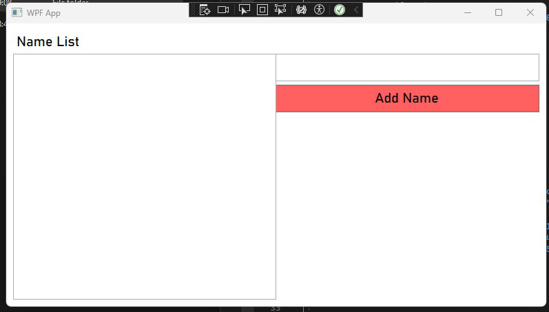
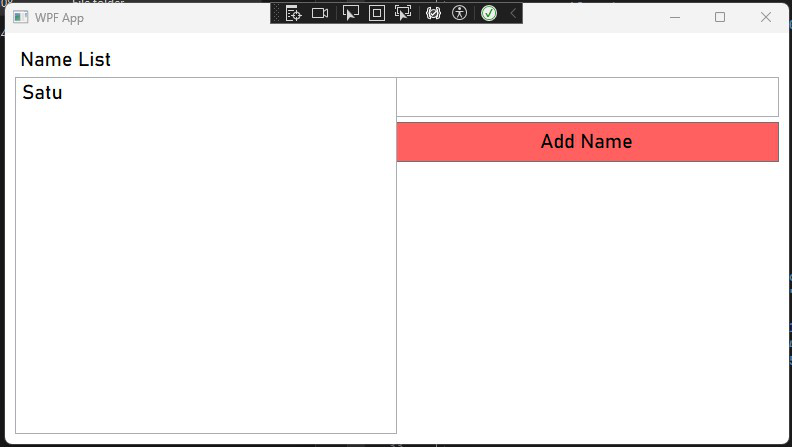

# CalculatorDesktopApp

<h2>Membuat Aplikasi WPF Sederhana Menggunakan Bahasa C#<h2>

## Nama : Sandyatama Fransisna Nugraha
## NRP: 5025211196
## Kelas : PBKK B
## Tahun : 2023

 

## Ini adalah tugas Ketiga dari mata kuliah Pemrogaman Berbasis Kerangka Kerja untuk mempratekkan penggunaan framework .NET dengan menggunakan bahasa C#. Untuk IDEnya, saya menggunakan Visual Studio Community dimana IDE ini adalah IDE yang compatible untuk melakukan pembuatan aplikasi desktop. 

## Aplikasi WPF yang dibuat adalah aplikasi sederhana yang memuat fitur dasar seperti operasi penambahan nama yang bisa di save dan bisa menambahkan nama baru. 

### 1. Membuka Program

### 2. Menambahkan Nama Pertama

### 3. Menambahkan Nama Kedua

